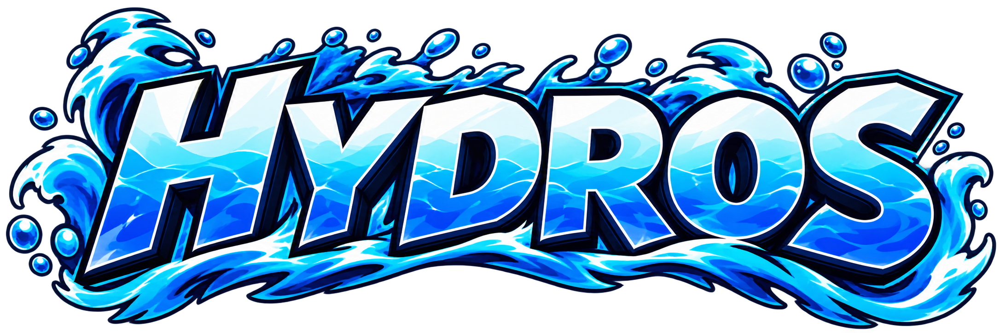

  

  

  
  
  
  
  
  
  

---

## 🌊 About Me

Hey, I'm **Hydros**! I've been making content since **2009**, and these days I wear a few different hats:

- 🎥 **Content Creator & Streamer.** Gaming videos on YouTube and live streams on Twitch.
- 💻 **Web Developer.** I build and run game database sites, community guides, and stream tools.
- 🎨 **Graphic Designer.** Logos, overlays, thumbnails, and branding.
- 🏢 **Owner & Chief Technology Officer** at **59 Gaming, Inc.**
- 🎮 **Gamer.** Pokémon, Dragon Ball, and My Hero Academia games are where most of my projects come from.
- 📺 **Anime fan.** I post reviews of what I'm watching over at [hydros.tv](https://hydros.tv).

## 🚀 Current Projects

### 🌐 Game Databases

| Site | Game |
| --- | --- |
| [**ultrarumble.com**](https://ultrarumble.com) | My Hero Ultra Rumble |
| [**dokkanbattle.net**](https://dokkanbattle.net) | Dragon Ball Z Dokkan Battle |
| [**dblegends.net**](https://dblegends.net) | Dragon Ball Legends |
| [**myherous.com**](https://myherous.com) | My Hero United Survival |
| [**myheroui.com**](https://myheroui.com) | My Hero Ultra Impact (archive) |

### 🛠️ Open Source

| Project | Description |
| --- | --- |
| [**ultrarumbleguide**](https://github.com/HydrosPlays/ultrarumbleguide) | A community-driven, in-depth guide for My Hero Ultra Rumble, live at [ultrarumble.com/guide](https://ultrarumble.com/guide). |
| [**TidalHeX**](https://github.com/HydrosPlays/TidalHeX) | My fork of [PKHeX](https://github.com/kwsch/PKHeX), the Pokémon save file editor. |
| [**Nacre Shiny Hunt Tracker**](https://github.com/HydrosPlays/Nacre-Shiny-Hunt-Tracker) | An animated OBS shiny-hunting counter with Stream Deck control, live type theming, and accurate shiny odds. |
| [**Nautilus Living Dex Tracker**](https://github.com/HydrosPlays/Nautilus-Living-Dex-Tracker) | A Pokédex-themed web app for tracking Living Dex completion (normal & shiny) across every mainline Pokémon game. |

## 🧰 Toolbox

  
  
  
  
  
  
  

